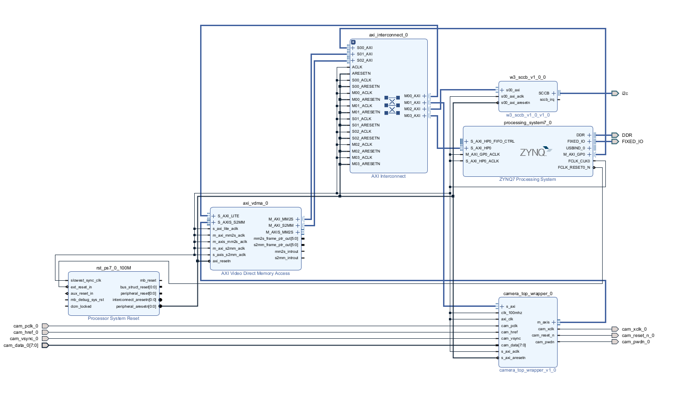
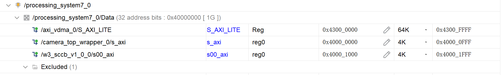
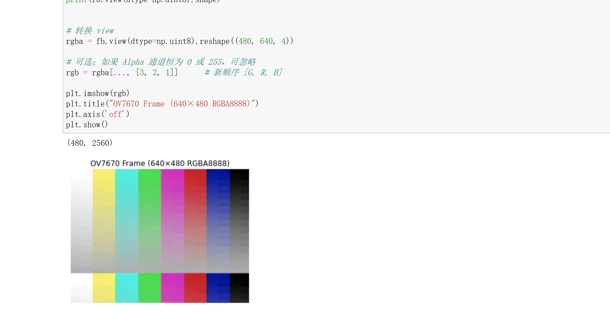

# OV7670 摄像头 FPGA 驱动项目

本项目实现了基于FPGA的OV7670摄像头驱动系统，包含完整的硬件设计IP核和Python驱动程序，可用于图像采集和处理应用。

## 项目概述

本项目通过FPGA实现OV7670摄像头的控制和数据采集，主要包含以下部分：

- 硬件IP核：
  - SCCB控制器：用于摄像头参数配置和状态读取
  - DVP转AXI-Stream转换器：将摄像头DVP并行输出转换为AXI-Stream流
- 软件驱动：
  - Python驱动类：整合了摄像头初始化、配置、图像采集等功能
  - 示例程序：展示如何使用驱动类进行图像采集和显示

## 硬件设计

硬件设计包含两个主要IP核：

1. **SCCB控制器**：
   - 实现I²C兼容的SCCB协议
   - 通过AXI总线控制
   - 用于配置OV7670摄像头寄存器

2. **DVP转AXIS转换器**：
   - 将OV7670的DVP并行数据流转换为AXI-Stream
   - 支持帧同步和数据有效性检测
   - 兼容标准AXI-Stream接口

### 系统顶层设计

下图展示了项目部署测试时使用的顶层设计（可变，时钟推荐100MHZ）：



*图1：OV7670摄像头系统顶层设计*

### AXI地址映射

下图展示了系统中的AXI地址分配示意（可自定义）：



*图2：AXI总线地址映射*

硬件设计中的AXI地址分配是可自定义的，不必严格按照示例设计。您可以根据自己的系统设计调整地址映射，但需要相应修改驱动程序中的地址配置。

### 默认地址映射

| 设备 | 基地址 | 大小 |
|------|--------|------|
| SCCB控制器 | 0x40001000 | 0x1000 |
| 摄像头控制器 | 0x40000000 | 0x1000 |
| VDMA | 0x43000000 | 0x10000 |

## 软件驱动

软件驱动由Python编写，基于PYNQ框架，主要包含两个类：

1. **SCCBDriver**：SCCB协议控制器驱动
2. **Ov7670Cam**：高级摄像头控制类，整合了SCCB、摄像头控制和VDMA功能

### 主要功能

- 摄像头初始化和配置
- 寄存器读写操作
- 图像采集和显示
- 多种预设配置（正常模式和测试模式）
- 资源管理

## 使用方法

### 1. 硬件准备

1. 将项目中的IP核添加到Vivado设计中
2. 参考顶层设计示意图连接IP核
3. 生成比特流文件

### 2. 软件设置

1. 确保环境中已安装PYNQ、NumPy和Matplotlib
2. 下载比特流到FPGA开发板

### 3. 使用示例

基本使用流程如下：

```python
from Ov7670Cam import Ov7670Cam

# 创建摄像头实例
camera = Ov7670Cam(bitstream_path="runs/camera_design.bit")

# 初始化摄像头
camera.init_camera()

# 配置摄像头 - 使用测试模式
camera.configure_camera("test_pattern")

# 设置VDMA
camera.setup_vdma()

# 显示图像
frame = camera.display_frame()

# 使用完毕后释放资源
camera.close()
```

更详细的使用示例请参考`example_usage.py`文件。

## 测试彩条图

下图展示了使用测试图案模式下的输出结果：



*图3：OV7670测试图案输出*

## 注意事项

1. **色彩配置**：
   - 当前预设的寄存器配置方案下获取的图像可能不是最优效果
   - OV7670的图像色彩配置较为复杂，可能需要针对具体应用场景进行优化
   - 建议优先调通测试图案模式，确认硬件连接和基本功能正常

2. **测试图案**：
   - 正确的测试图案颜色顺序应为：**白、黄、青蓝、绿、紫、红、蓝、黑**
   - 同时测试图案应正确显示灰阶样式
   - 如颜色顺序不正确，可能需要调整RGB通道映射或硬件连接

3. **地址配置**：
   - 如修改了硬件设计中的AXI地址映射，需同步更新软件驱动中的地址设置

4. **资源释放**：
   - 使用完毕后务必调用`close()`方法释放资源

## 开发与调试建议

1. 首先使用测试图案验证摄像头连接和驱动功能
2. 验证SCCB通信正常（可通过读取产品ID确认）
3. 调试正常图像采集模式
4. 根据需要优化色彩配置参数

## 系统要求

- Xilinx FPGA开发板（如PYNQ-Z1/Z2、Zynq UltraScale+等）
- Python 3.6+
- PYNQ框架
- NumPy和Matplotlib库 